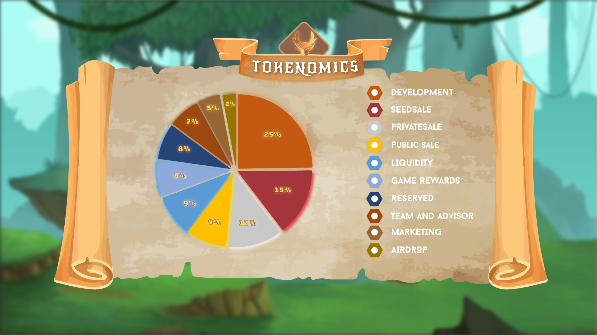

# Insignia (SGN)

Insignia (SGN), an ERC20 token, is the governance token for Project Exuvia that is used on Heroes Uprising. Having SGN allows its users the ability to vote on modifications to the project's future, allowing them to have their voices heard. Staking is another way for holders to earn SGN. Insignia will be used also for purchasing Sword and minting Heroes. It is also a requirement for Forging Swords and Sprite Fusions.

### SGN Tokenomics

| SECTION          | VALUE              |
| ---------------- | ------------------ |
| Initial Supply   | 100,000,000 $SGN   |
| Max Supply       | 1,000,000,000 $SGN |
| Token Type       | Governance Token   |
| Decimals         | 18                 |
| Ticker           | SGN                |
| Network          | Polygon            |
| Contract Address | TBA                |


only 10% of the total max supply will be generated as an initial supply and the rest will be generated through staking.


### Token Breakdown

| SECTION                 | ALLOCATION | TOKENS          | VESTED                                                                                     |
| ----------------------- | ---------- | --------------- | ------------------------------------------------------------------------------------------ |
| Development             | 25%        | 25,000,000 $SGN | [YES](https://docs.heroesuprising.com/tokens-and-funds-information/token-release-schedule) |
| Seed Sale               | 15%        | 15,000,000 $SGN | [YES](https://docs.heroesuprising.com/tokens-and-funds-information/token-release-schedule) |
| Private Sale            | 12%        | 12,000,000 $SGN | [YES](https://docs.heroesuprising.com/tokens-and-funds-information/token-release-schedule) |
| Public Sale             | 9%         | 9,000,000 $SGN  | [NO](https://docs.heroesuprising.com/tokens-and-funds-information/token-release-schedule)  |
| Liquidity               | 9%         | 9,000,000 $SGN  | [YES](https://docs.heroesuprising.com/tokens-and-funds-information/token-release-schedule) |
| Game Rewards            | 8%         | 8,000,000 $SGN  | [YES](https://docs.heroesuprising.com/tokens-and-funds-information/token-release-schedule) |
| Reserved                | 8%         | 8,000,000 $SGN  | [YES](https://docs.heroesuprising.com/tokens-and-funds-information/token-release-schedule) |
| Team & Advisor          | 7%         | 7,000,000 $SGN  | [YES](https://docs.heroesuprising.com/tokens-and-funds-information/token-release-schedule) |
| Marketing               | 5%         | 5,000,000 $SGN  | [YES](https://docs.heroesuprising.com/tokens-and-funds-information/token-release-schedule) |
| Airdrop & Event Rewards | 2%         | 2,000,000 $SGN  | [YES](https://docs.heroesuprising.com/tokens-and-funds-information/token-release-schedule) |
