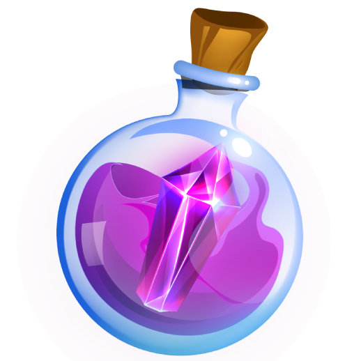

# Rare Amethyst Particle (RAP)

Rare Amethyst Particle (RAP) is a reward/utility token that can be obtained by exchanging it with _Rare Amethyst Shards_ (an in-game currency). This can also be used to purchase weapons and heroes at the marketplace.

Please keep in mind that claiming your RAP takes two weeks. After that, you can make a claim after two weeks again.

You can sell or exchange your Rare Amethyst Particles on decentralized exchanges and Aivuxe.
