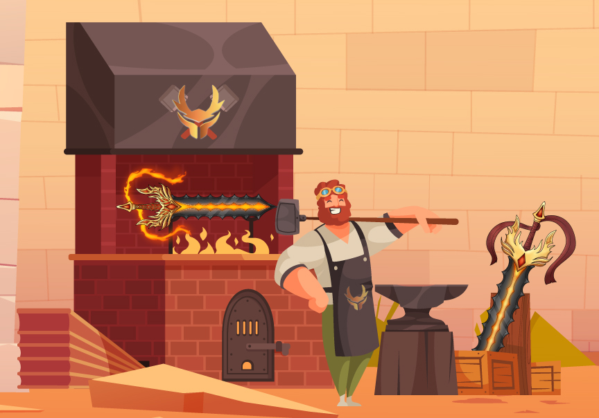

# Forging System

If you want a better card combination, you can forge new weapons, exactly as in any other fantasy game. These weapons can be utilized in battle, used to make new weapons, or sold on the open market.


Players can only forge their weapons five times with every forge increasing the SGN And RAP required.


## Sword parts

Sword can be varied at 4 parts and each parts has its designated cards for the game

While forging this parts will be randomly dismantle to create a new weapon and cards combination within it.

Category of the swords element will be determined on the blade.

## **Forging Fees**

| FORGE COUNT | Forge Number | RAP | SGN |
| ----------- | ------------ | --- | --- |
| **0/5**     | 1            | 150 | 6   |
| 1/5         | 2            | 300 | 6   |
| 2/5         | 3            | 450 | 6   |
| 3/5         | 4            | 600 | 6   |
| 4/5         | 5            | 750 | 6   |

These figures may change depending on the games economic balance. The RAP and SGN require per forge can change.&#x20;

## **Genetics**

Swords has 4 parts, each part possesses 4 genes. A dominant (D), major recessive (R1), minor recessive (R2), and hidden recessive gene (R3). The idea comes from a well known game called Axie Infinity, and Cryptokitties


The dominant gene is what determines the part that is physically present on the Sword. When forging, each gene has a chance to be passed down to the forged weapon:


* **Dominant (D):** 60% chance to pass this gene to the forged weapon.
* **Major Recessive (R1):**  24.125% **** chance to pass this gene to the forged weapon.
* **Minor Recessive (R2):**   12.135% chance to pass this gene to the forged weapon.
* **Hidden Recessive (R3):** 3.74% chance to pass this gene to the forged weapon

## Element Calculation

Each forged weapon has 50% chance of inheriting each of the weapons element used on forging. So if you pair two different elements then you have a 50% on producing the other and 50% on producing the other weapons element. If you pair both of the same elements, the forged weapon is guaranteed that element.

