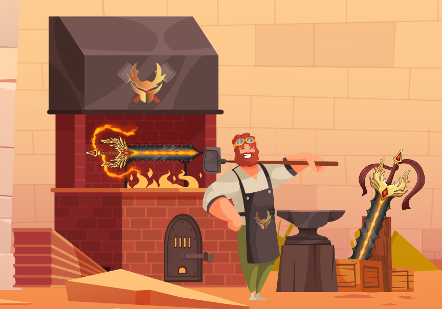

# Forging

If you want a better card combination, you can forge new weapons, exactly as in any other fantasy game. These weapons can be utilized in battle, used to make new weapons, or sold on the open market.


Players can only forge their weapons five times only with every forge increasing the SGN And RAP Required


### Sword parts

Sword can be varied at 4 parts and each parts has its designated cards for the game

While forging this parts will be randomly dismantle to create a new weapon and cards combination within it.

Category of the swords element will be determined on the blade.
