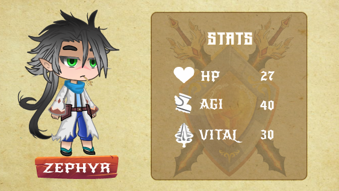
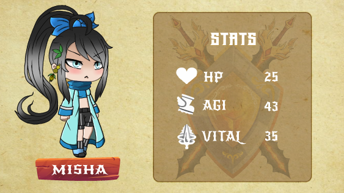

# Wind element

### Zephyr

Rarely seen by anyone due to his unmatched speed, fights with him rarely last few seconds enemies go down before even realizing what happened

### Misha

Described by people who encountered her as a soft gentle breeze, Misha fights enemies with quick calculated cuts that render foes weak.
